# Legged Robotics
## Project I Forward Kinematics and Inverse Kinematics


## 环境安装

当前工程需要python执行环境和C++编译环境，目前没有发现对于python版本有特殊要求，建议python版本大于3.8

1.安装conda环境（非必须）

```shell
conda create -n your-env-name python==3.8
```

2.安装需要的python库

```shell
pip install numpy pybullet
```


## 作业要求（更新）

如果在作业过程中遇到问题，可以在群里或者issues中反馈。

### 第三章 运动学计算

1.运行kinematic.py文件，确定仿真环境能正常打开

```shell
python kinematic.py
```

2.完成文件中legForwardKinematic, legInverseKinematic函数，确保终端输出的打印值相等

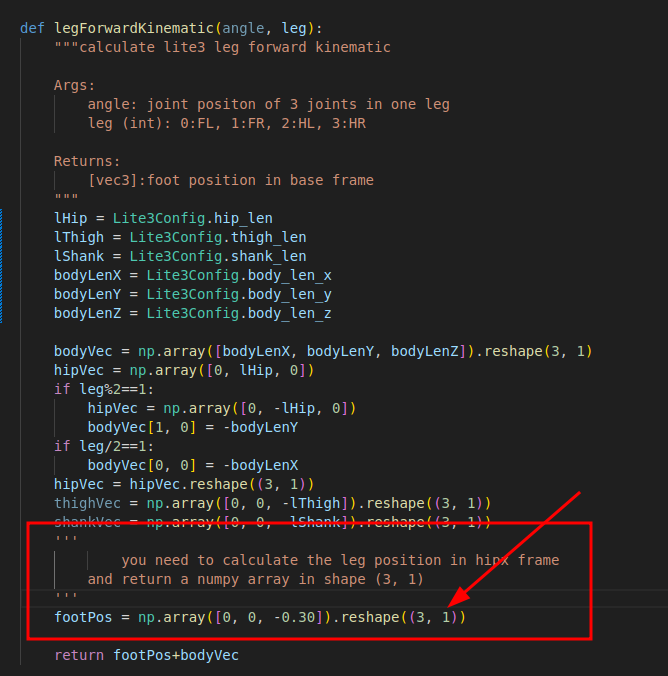

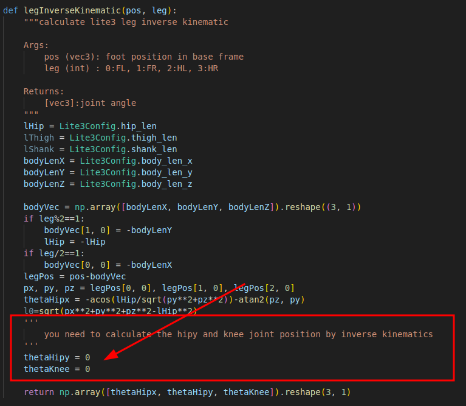

3.修改文件中的legNum值，拉动对应腿关节的角度设置，根据终端打印确定在关节限幅范围内不同腿的正逆运动学求解正确。


### 第四章 插值与规划

第四章作业需要在完成第三章作业的基础上进行

1.确保在第三章的基础上能够正常打开仿真环境，正确计算机器人左前腿的逆运动学。

2.在interpolation.py文件中完成已知初始状态和终止状态的情况下，求解中间点的位置值


3.完成机器狗左前腿的摆动函数，画出左前腿各关节的角度，确保曲线平滑，并且初始点和末端点的关节期望速度均为0。

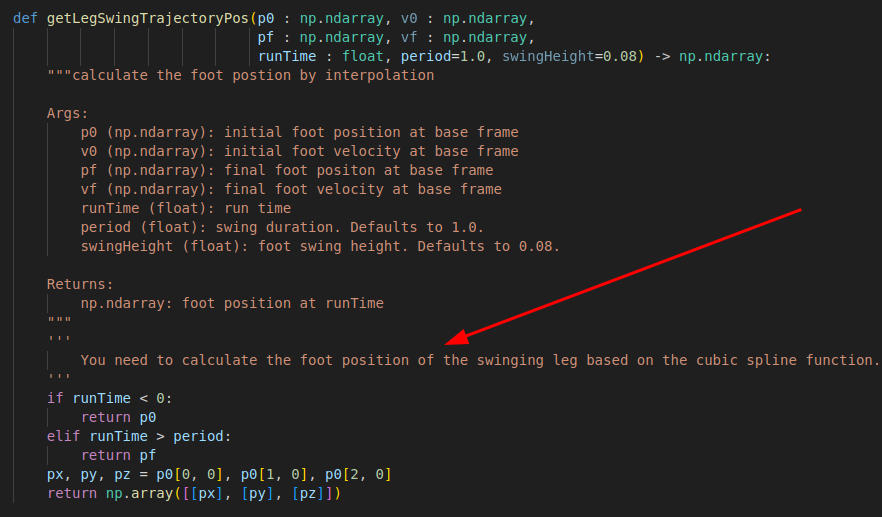

4.修改摆动参数在仿真中Lite3机器狗能够成功实现迈步，并且没有碰倒脚下的方块，实际效果如下动图所示。

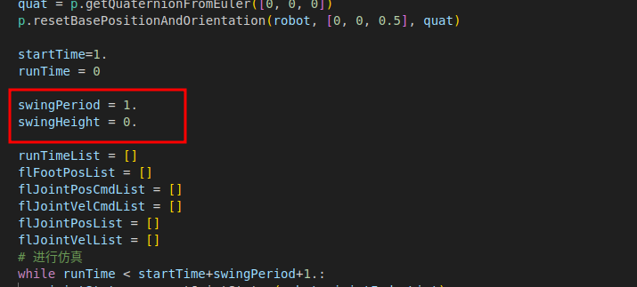

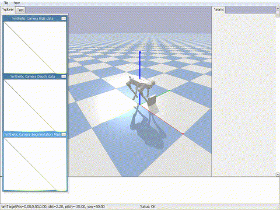


### 第五章 状态估计

第五章作业需要在完成第三章的基础上进行

1.完成kalman filter迭代过程计算，画出Lite3里程计和速度估计曲线。

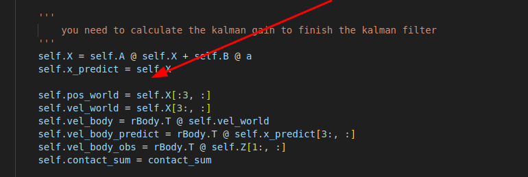

2.修改方差，观察滤波效果。

3.尝试其他状态方程和观测方程。


注意：

1.运行在确保python环境中安装pandas和matplotlib。

```shell
pip install pandas matplotlib
```

2.因为数据从仿真环境中获取，所以手动添加传感器数据的噪声。

3.触地判断采用触地力反算，在动力学中是有问题的，这里先直接使用，不做深入探讨。

4.实际上观测方程的方差应为与机器人状态相关的量，这里我们工程性的设置为常数。


### 第七章 虚拟模型控制

第七章作业需要运用C++编程语言完成，编译需要在ubuntu环境下进行。

代码框架介绍：

1.本章作业是在https://github.com/DeepRoboticsLab/Lite3_rl_deploy.git基础上修改实现的，可以参考阅读一下仓库中的介绍文件

2.本章的状态机转化如图所示，箭头上的字母表示键盘值。具体的映射关系可以参考/virtual_model_control/interface/user_command/keyboard_interface.hpp文件里的内容

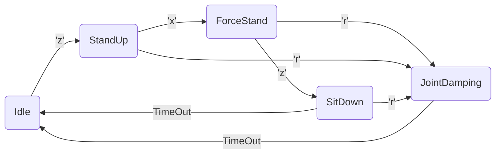

3.本章作业只涉及到虚拟模型控制下的站立解算，作业内容只在/virtual_model_control/state_machine/force_stand_state.hpp文件中，需要完成相应的函数内容。

4.本章采用QP解算库为eiquadprog，位于/virtual_model_control/utils路径下，使用solve_quadprog(...)函数求解QP问题，依赖于eigen库，也包含在third_party/目录下，详细的QP方程解算介绍在文件的开始位置也有介绍。

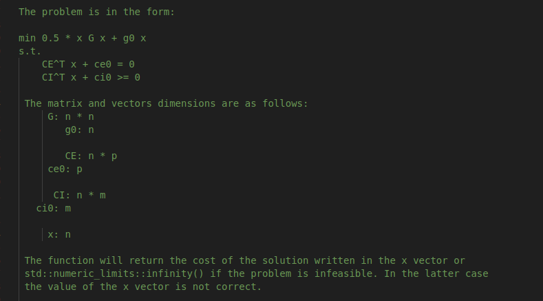

5.控制算法与pybullet仿真界面是通过本机UDP通讯的方式，确保默认收发端口号20001和30010没有被占用。如果端口被占用，在/virtual_model_control/interface/robot/simulation/pybullet_interface.hpp文件和/virtual_model_control/interface/robot/simulation/pybullet_simulation.py文件中有相应的设置。

6.本章作业不涉及状态估计，直接将四条腿支撑腿的中心位置作为世界坐标系的原点，工程应用上可以这样处理。


作业内容：

1.确保仿真界面能成功打开，执行

```shell
python /*your path to virtual_model_control*//interface/robot/simulation/pybullet_simulation.py
```

执行后，仿真模型成功加载出来，应如下图所示，一直保持仿真界面处于运行状态，如果机器人处于异常状态，可以重新打开仿真界面。

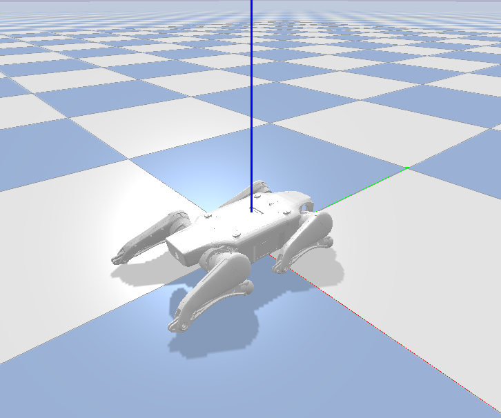

2.确保C++代码能成功编译。新开终端运行如下步骤，查看控制算法能够正常运行。

```shell
cd your path to virtual_model_control
mkdir build
cd build
cmake .. -DBUILD_PLATFORM=x86 -DBUILD_SIM=ON -DSEND_REMOTE=OFF
make -j4
./vmc_stand
```

3.上述步骤操作成功后可以修改/virtual_model_control/state_machine/force_stand_state.hpp文件中的函数，完成本章作业。

​	(1)根据虚拟模型控制的内容填充A和b矩阵

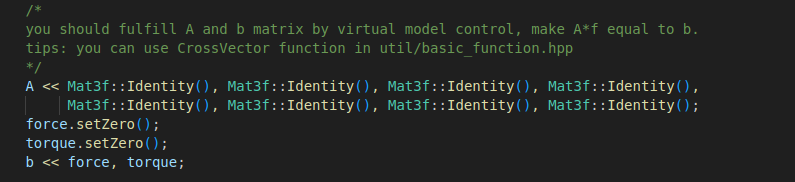

​	(2)根据最小二乘法求解虚拟力

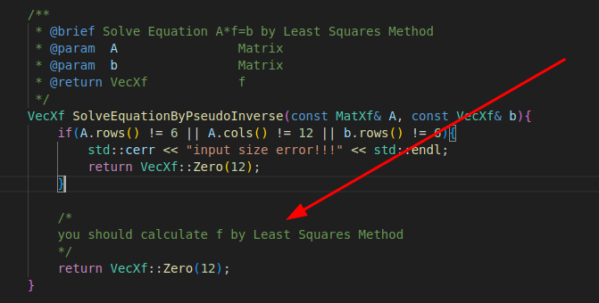

​	如果上述步骤操作正确，在仿真中切换至状态机ForceStand，按下键盘上的wasdqe键，能够实现Lite3的姿态控制


​	(3)根据二次规划的方法求解，这里地面处于水平，可以先不考虑斜面摩擦的约束。求解正确的情况下，效果应与上图一致。

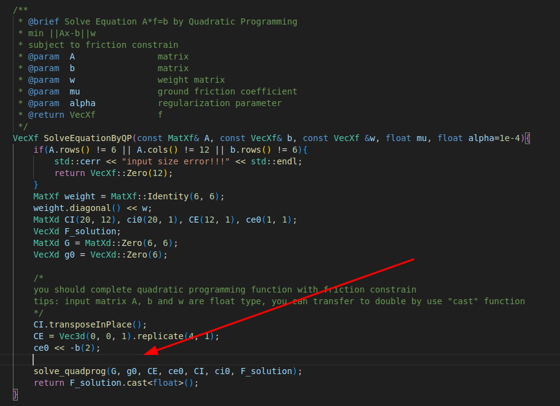

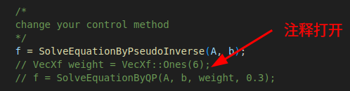

​	(4)有兴趣可以修改参数或者仿真环境中的摩擦力系数，观察区别。

​	(5)程序也可以部署在真实机器人上，效果如图。


作业要求：

1.整理VMC算法公式，并调研伪逆和二次规划问题（QP）求解

2.验证每条腿的雅可比矩阵求解是否正确

3.补全代码实现基于VMC的机器人站立以及扭动控制

## 参考资料（持续更新）

1. 梶田秀司．仿人机器人． 北 京： 清 华 大 学 出 版 社，2007.
2. Craig, John J. *机器人学导论*. China Machine Press, 2005.
