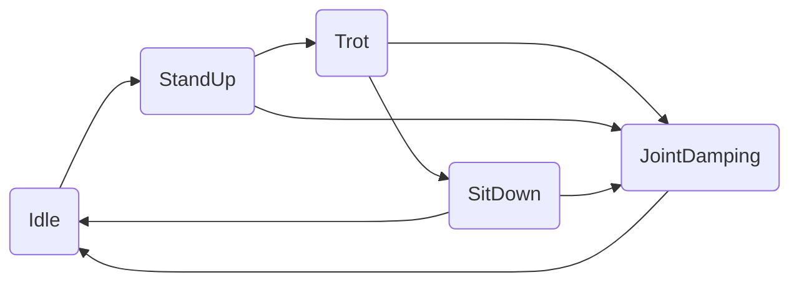
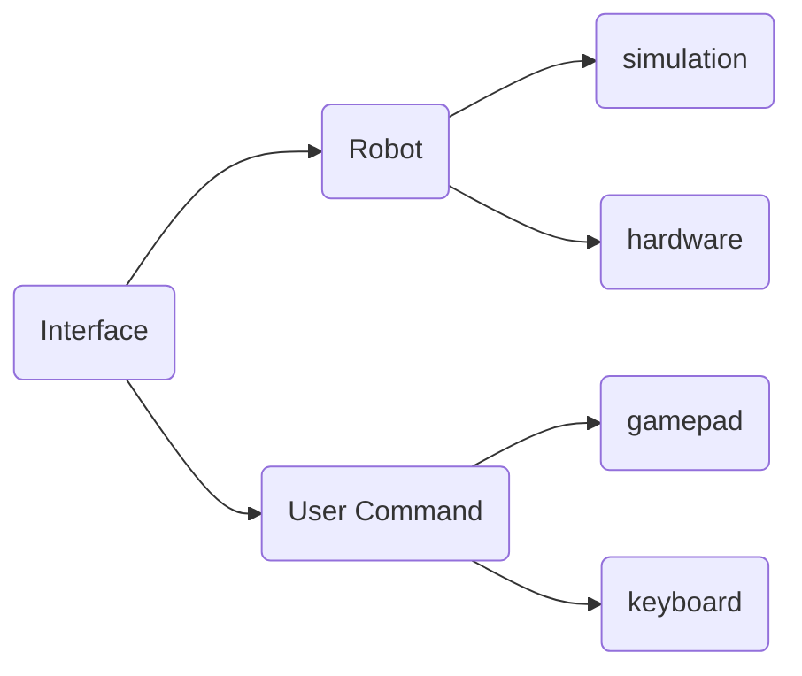

# VMC_DEPLOY

## 一、程序编译

1.仿真验证

(1).新开终端打开仿真环境，示例程序中给出了基于pybullet平台的仿真验证程序，有兴趣的同学可以前往https://pybullet.org/wordpress/ 了解接口，可以通过pip安装pybullet。

```shell
pip install pybullet
```

确保之后打开仿真界面

```shell
cd your path to workspace/interface/simulation/
python pybullet_simulation.py
```

打开之后的界面应该成功加载X30的仿真模型。


(2).编译仿真运行，执行如下指令确保程序能正常编译。

```shell
cd deeprobotics_rl_deploy
mkdir build && cd build
cmake .. -DBUILD_PLATFORM=x86 -DBUILD_SIM=ON -DSEND_REMOTE=OFF 
make -j4;./rl_deploy
```

之后键盘上按下z键，X30会进入到站立状态，之后按下c键X30会进入踏步状态，踏步10次后X30会进入趴下状态。在上述状态中按下r键X30会进入阻尼模式。


2.实物部署

建议实物部署在完成上述仿真验证后再进行，这里介绍远程交叉部署。

(1).X30上的运动主板是arm架构，如果希望本地电脑交叉编译在狗上运行的程序需要在本地安装交叉编译工具

```bash
sudo apt-get install gcc-aarch64-linux-gnu g++-aarch64-linux-gnu
```

(2).在本地电脑上安装expect脚本解释器 

```shell
sudo apt-get install expect
```

(3).连上机器狗的wifi 

(4).在本机执行scripts目录下的create_remote.sh脚本，注意修改脚本中定义的ip和用户名 

(5).ssh [ysc@192.168.1.103](mailto:ysc@192.168.1.103)连进狗的运动主机。修改X30运动主机中~/jy_exe/conf/network.toml将ip项修改为运动主机本地的ip为192.168.1.103或者其他本地ip，确定与interface/robot/hardware/x30_hardware_interface.hpp中构造函数的robot_ip和local_port对应上。这里可以参考https://github.com/DeepRoboticsLab/x30_motion_sdk/blob/master/README_ZH.md。然后重新执行 sudo ~/jy_exe/restart.sh脚本重启运动程序，注意这时机器狗一定要在平躺在地面上关节不发力状态。 

(6).进入本地的rl_deploy文件夹，执行编译执行流程。

```shell
 mkdir build 
 cd build 
 cmake .. -DBUILD_PLATFORM=arm -DBUILD_SIM=off -DSEND_REMOTE=ON 
 make -j4 
```

(7).远程ssh连接X30的运动主机。进入~/rl_deploy/bin/目录下执行./rl_deploy。观察程序能否正常运行，解决具体问题。实现键盘控制或者手柄控制。


## 二、注意事项

1.目前示例给出的远程遥控是按照键盘输入来的，可以在/state_machine/state_machine.hpp文件中指定机器狗的控制输入。如果改成手柄指令输入建议提前根据https://github.com/DeepRoboticsLab/gamepad.git 中的介绍提前测试一下手柄的通讯是否正常。

2.建议本地电脑系统为ubuntu，版本>=18.04。如果没有只能尝试将程序放在狗的运动主机上编译运行。

3.建议将X30机器狗平放在地面摩擦力比较大的平整地面上进行部署实验


## 三、程序重要模块介绍

### state_machine




state_machine是X30在不同的状态之间来回切换的状态机，不同的状态代表的功能如下：

1.Idle 空闲状态，表示机器狗处于关节不发力的情况

2.StandUp 站起状态，表示机器狗从趴下到站起的动作

3.Trot 采用虚拟模型控制(Virtual Model Control)的方法，使X30处于原地踏步的状态

4.JointDamping 关节阻尼状态，表示机器狗的关节处于阻尼控制状态

5.SitDown 坐下状态，机器狗执行从站立到趴下的状态


### interface



interface模块表示狗的数据接受和下发接口和手柄控制的输入。其中机器狗平台的输入分为仿真和实物，手柄的输入分为键盘和手柄控制。


