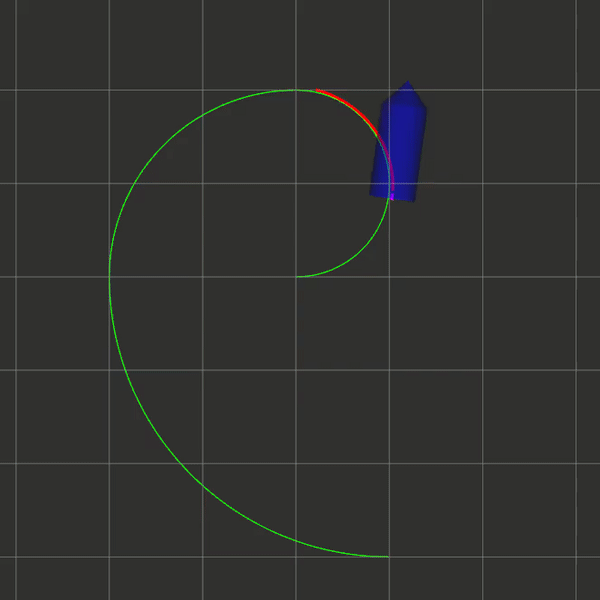

## HOW TO RUN
```
路径中有中文，请单独把mpc-ros文件夹拷贝出去进行编译运行
./install_tools.sh
catkin_make -j1
source devel/setup.zsh
roslaunch mpc_car simulation.launch
```
## HOW TO TURN PARAMETERS
```
./src/mpc_car/config/mpc_car.yaml -> mpc parameters
./src/car_simulator/config/car_simulator.yaml -> initial states (in simulation)
```

## Homework1
> Implement MPC of tracking the reference trajectory in C++;

$$ min  J = \sum_{i=0}^N (x-x_r)^2+ (y-y_r)^2 + rho * (phi-phi_r)^2 $$

$$s.t. -0.1 <= v_k <= v_{max}                 $$
$$     |a_k| <= a_{max}                       $$
$$     |delta_k| <= delta_{max}               $$
$$     |delta_{k+1} - delta_k| <= ddelta_{max}$$

## Homework2
> Implement MPC with delays in C++;

## Homework3 (optional)
> Implement MPCC in C++;


__[ATTENTION]__ Only <TODO: > of codes in src/mpc_car/include/mpc_car/mpc_car.hpp is required.

## AN EXAMPLE
<p align="center">
    
</p>
