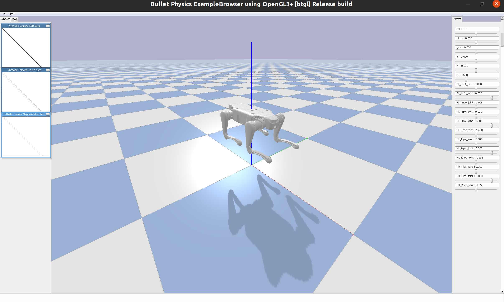
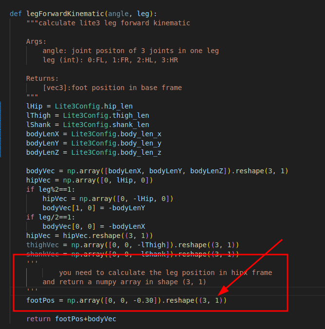
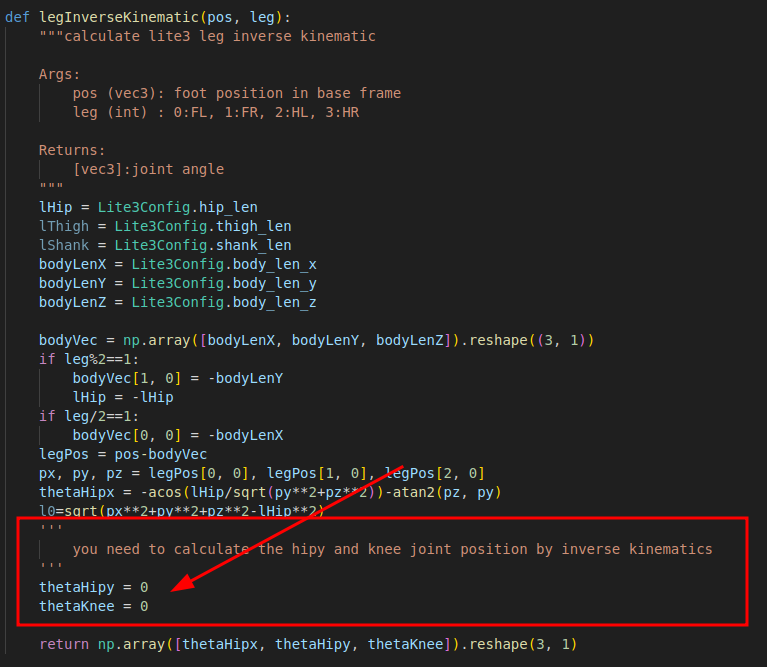
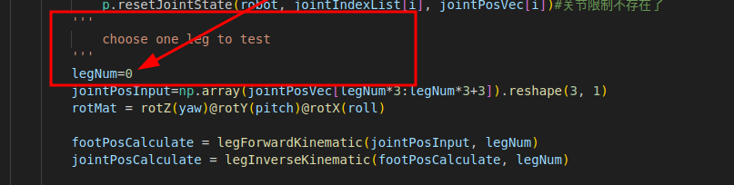

# LeggedRobotics


## 环境安装

当前工程需要python执行环境和C++编译环境，目前没有发现对于python版本有特殊要求，建议python版本大于3.8

1.安装conda环境（非必须）

```shell
conda create -n your-env-name python==3.8
```

2.安装需要的python库

```shell
pip install numpy pybullet
```


## 作业：运动学计算

如果在作业过程中遇到问题，可以在群里反馈~~

### 作业目标

通过手写代码计算足式机器人足端的正逆运动学计算函数，解算给定关节角求解足端位置（正运动学）以及给定足端位置求解关节角（逆运动学），并与仿真器计算得到的结果进行对比验证结果的正确性。


### 代码运行与作业内容
1.运行kinematic.py文件，确定仿真环境能正常打开

```shell
python kinematic.py
```

运行成功后仿真环境如下图所示，可以通过移动右侧的滑块来调整四足机器人的运动学状态。

<center></center>
<center>图1： 仿真运行成功示例</center>


2.完成文件中legForwardKinematic, legInverseKinematic函数，确保终端输出的打印值相等

<center></center>
<center>图2： legForwardKinematic函数</center>

<center></center>
<center>图3： legInverseKinematic函数</center>

3.修改文件中的legNum值，拉动对应腿关节的角度设置，根据终端打印确定在关节限幅范围内不同腿的正逆运动学求解正确。

<center></center>
<center>图4： 主函数LegNum参数</center>

### 作业要求
- 提交正确补全了相关函数的代码包（能计算四条腿的正逆运动学且计算结果和仿真器结果相符）
- 提交作业报告内容包括： 

    1）写出足式机器人的正逆运动学公式（可以使用word/latex/markdown等书写或手写），禁止截图课件或其他资料。

    2）给出能够正确运行仿真的截图，如本说明中的图1.

    3）给出代码运行的结果（terminal中四条腿的正逆运动学计算结果与仿真结果对照图）。


## 参考资料（持续更新）

1. 梶田秀司．仿人机器人． 北 京： 清 华 大 学 出 版 社，2007.
2. Craig, John J. *机器人学导论*. China Machine Press, 2005.